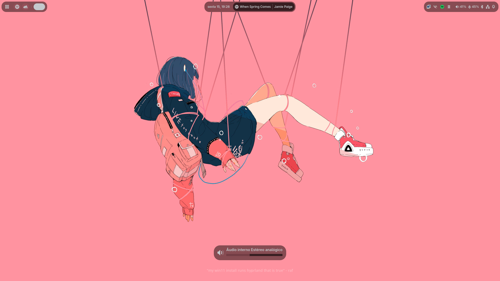
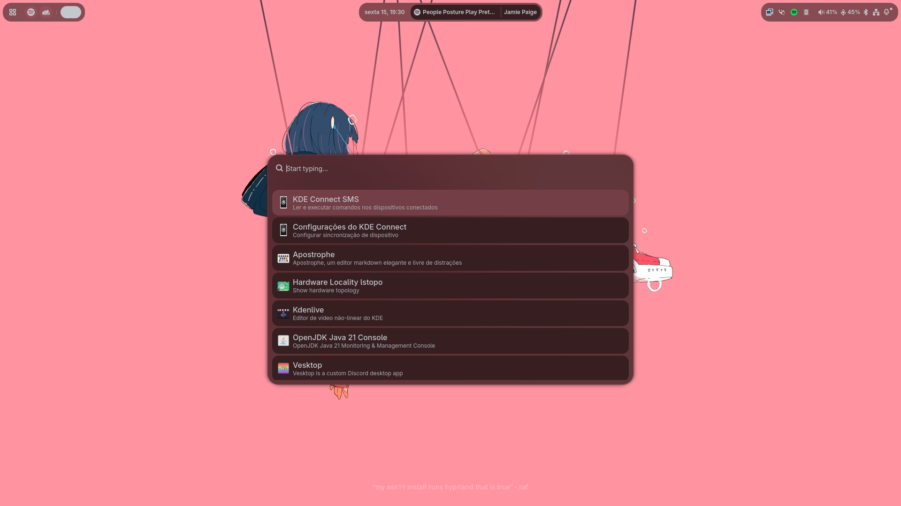
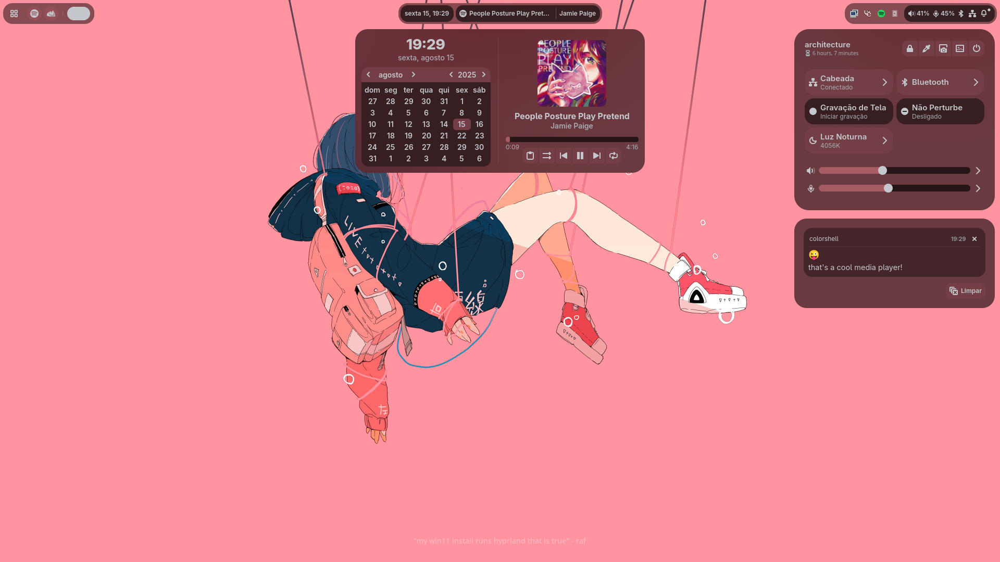
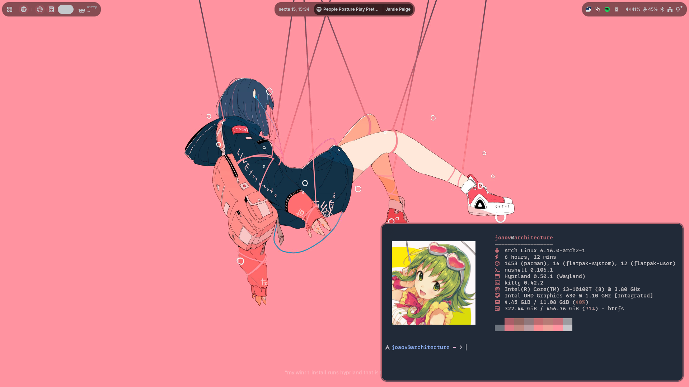

# colorshell

> [!note]
> My personal dotfiles are now on [retrozinndev/Hyprland-Dots](https://github.com/retrozinndev/Hyprland-Dots)

This is the repository for the colorshell desktop shell, made for Hyprland with [TypeScript], [GTK4], [AGS], [Gnim], and some of the [Astal] libraries.

It really took me a lot of time to make this, so please star the repo if you like it! :star:

## 🌄 Screenshots

## 🎨 Colors
All the shell colors are dynamically generated from your wallpaper! 

This is possible by using [pywal16], a fork of the archived [pywal](https://github.com/dylanaraps/pywal) project. 
It's a cli tool to generate color schemes from an image.

## 🖼️ Wallpapers

These are not included in the shell anymore, because the repository was getting too big in size. 
So you'll have to add it in your own.

You can define the `WALLPAPERS` variable in your hyprland user configuration to your wallpapers folder, 
or create the `~/wallpapers` directory and put your wallpapers there.

Also, you can select any of the images inside `~/wallpapers` by pressing 
<kbd>SUPER</kbd> + <kbd>W</kbd> or by accessing the Control Center and clicking in the image 
icon on top.

## ✔️ What's included in this shell

  
- Pretty Top-Bar
  - Apps(basically the "start menu", opens the full-screen app launcher)
  - Workspaces indicator
  - Focused Client(window) information(title, class and icon)
  - Clock(with date)
  - Media(shows only when media is being played)
  - Tray(Applications running in the background)
  - Status (volume information, bluetooth, network and notification status)
- Control Center
  - Volume Controls (Microphone and Speaker)
    - Volume Mixer(per-app volume)
  - Pages(the thing that shows up when you click the arrow on a tile)
    - Bluetooth devices
    - Network devices
    - Night Light controls
  - Tiles
    - Screen Recording
    - Bluetooth
    - Night Light
    - Network(wifi needs work, i don't have wifi in my machine)
    - Don't Disturb(disables notification popups)
- Center Window(clock, calendar + media management)
- Notifications with support for application actions + Notification History
- Localization(see [🌐 Internationalization](#-internationalization) for available languages)
- Application Runner with support for plugins ([anyrun](https://github.com/anyrun-org/anyrun)-like)
  - Shell(`!`): Run shell commands with the user shell
  - Clipboard(`>`): Search through your clipboard history
  - Wallpapers(`#`): Search and select to change wallpaper
  - Media(`:`): Control playing media
  - Search(`?`): Search something on the internet with your default browser
- Support for your multiple monitors
- Dynamic support for [UWSM](https://github.com/Vladimir-csp/uwsm)(apps will use uwsm if current session is using it)

## ⌨️ Binds
You can see default bindings and usage information on the [Wiki/Usage] page!

## 🌐 Internationalization
Colorshell supports i18n! The shell automatically matches the shell language with the system's, if available.  
Currently, there's support for the following languages: 
- **English** (English, United States), maintained by [@retrozinndev](https://github.com/retrozinndev)
- **Português** (Portuguese, Brazil), maintained by [@retrozinndev](https://github.com/retrozinndev)
- **Русский** (Russian), maintained by [@NotMephisto](https://github.com/NotMephisto)
  
Don't see your language here? You can contribute and make translations too!  
You can do so by forking this repository, translating the shell in your fork and then opening a pull request to this repository, simple as that!
(I'll create a more detailed guide for that soon)

## ⚙️ Installation
See the Installation Guide on [Wiki/Installation].

## ❗ Issues
Having issues? Please create a [new Issue] here, I'll be happy to help you out!

## 📜 License
This repo is licensed under the [MIT License], project is made and maintained by [retrozinndev](https://github.com/retrozinndev).

## 🌠 Stargazers

  

 

Thanks to everyone who starred my project! 💖

<!-- References of other projects -->
[pywal16]: https://github.com/eylles/pywal16
[zen browser]: https://zen-browser.app
[neovim]: https://neovim.io
[nushell]: https://nushell.sh
[kitty]: https://sw.kovidgoyal.net/kitty
[ags]: https://aylur.github.io/ags
[gnim]: https://aylur.github.io/gnim
[astal]: https://aylur.github.io/astal
[typescript]: https://typescriptlang.org
[gtk4]: https://www.gtk.org
[gtk]: https://www.gtk.org

<!--  Web refs -->
[mit license]: https://en.wikipedia.org/wiki/MIT_License

<!-- Tabs -->
[wiki]: https://github.com/retrozinndev/colorshell/wiki
[issues]: https://github.com/retrozinndev/colorshell/issues

<!-- Wiki Pages -->
[wiki/dependencies]: https://github.com/retrozinndev/colorshell/wiki/Dependencies
[wiki/usage]: https://github.com/retrozinndev/colorshell/wiki/Usage
[wiki/installation]: https://github.com/retrozinndev/colorshell/wiki/Installation

<!-- Actions -->
[new issue]: https://github.com/retrozinndev/colorshell/issues/new
