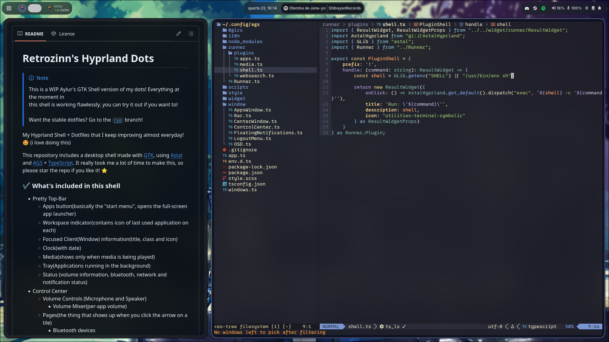

# colorshell

(previously retrozinndev/Hyprland-Dots)

My Hyprland desktop shell that I keep improving almost everyday! 🤩 (i love doing this)  

This repository includes a desktop shell made with [GTK], using [Astal] and [AGS] + [TypeScript]. 
It really took me a lot of time to make this, so please star the repo if you like it! :star:

## 🌄 Screenshots

## 🎨 Colors
All the shell colors are dynamically generated from your wallpaper! 
This is possible by using [pywal16](fork of the archived [pywal](https://github.com/dylanaraps/pywal) project), a cli tool to generate color schemes on the fly.

## 🖼️ Wallpapers
When you're at the [Installation](#Installation) process, you can choose whether to install the wallpapers. 
Or if you haven't, you can just create a directory `~/wallpapers` in your home `~` and put images you want to use as wallpapers!

You can select any of the images inside `~/wallpapers` by pressing <kbd>SUPER</kbd> + <kbd>W</kbd> or by accessing the 
Control Center and clicking in the image icon on top.

### ℹ️ Source
None of the wallpapers available in this repo are made by me! You can find sources inside the [`WALLPAPERS.md`](https://github.com/retrozinndev/Hyprland-Dots/blob/ryo/WALLPAPERS.md) file. (it took me a lot of time to make this sources list 😭)

### ✔️ What's included in this shell
- Pretty Top-Bar
  - Apps button(basically the "start menu", opens the full-screen app launcher)
  - Workspace indicator(contains icon of last used application on each)
  - Focused Client(Window) information(title, class and icon)
  - Clock(with date)
  - Media(shows only when media is being played)
  - Tray(Applications running in the background)
  - Status (volume information, bluetooth, network and notification status)
- Control Center
  - Volume Controls (Microphone and Speaker)
    - Volume Mixer(per-app volume)
  - Pages(the thing that shows up when you click the arrow on a tile)
    - Bluetooth devices
    - Network devices
    - Night Light controls
  - Tiles
    - Screen Recording
    - Bluetooth
    - Night Light
    - Network(wifi needs work, i don't have wifi in my machine)
    - Don't Disturb(disables notification popups)
- Center Window(clock, calendar + media management)
- Notifications with support for application actions + Notification History
- Localization(see [🌐 Internationalization](#-internationalization) for available languages)
- Application Runner with support for plugins ([anyrun](https://github.com/anyrun-org/anyrun)-like)
  - Shell(`!`): Run shell commands with the user shell
  - Clipboard(`>`): Search through your clipboard history
  - Wallpapers(`#`): Search and select to change wallpaper
  - Media(`:`): Control playing media
  - Search(`?`): Search something on the internet with your default browser
- Gnome-like application runner(the fullscreen one)
- Support for your multiple monitors

## ⌨️ Binds
You can see pre-configured bindings in the [Wiki/Bindings] page!

## 🌐 Internationalization
Colorshell supports i18n! Currently, there is support for the following languages: 
- English (United States), maintained by [@retrozinndev](https://github.com/retrozinndev)
- Português (Brasil), maintained by [@retrozinndev](https://github.com/retrozinndev)
  
Don't see your language here? You can contribute and make translations too!  
You can do so by forking this repository, translating the shell in your fork and then opening a pull request to this repository, simple as that!
(I'll create a more detailed guide for that soon)

## ⚙️ Installation
See the Installation Guide on [Wiki/Installation]. (needs updates, shell was just launched)

## 🎉 Tools
- Browser: [Zen Browser]
- Text Editor: [Neovim], my config is [here](https://github.com/retrozinndev/nvim-conf.lua)
- Terminal Emulator: [Kitty]
- Terminal shell: [Nushell]

## ❗ Issues
Having issues? Please create a [new Issue] here, I'll be happy to help you out!

## 📜 License
This repo is licensed under the [MIT License], project is made and maintained by [retrozinndev](https://github.com/retrozinndev).

## 🌠 Stargazers
Thanks to everyone who starred my project! 💖

<!-- References of other projects -->
[pywal16]: https://github.com/eylles/pywal16
[zen browser]: https://zen-browser.app
[neovim]: https://neovim.io
[nushell]: https://nushell.sh
[kitty]: https://sw.kovidgoyal.net/kitty
[ags]: https://aylur.github.io/ags
[astal]: https://aylur.github.io/astal
[typescript]: https://typescriptlang.org
[gtk]: https://www.gtk.org

<!--  Web refs -->
[mit license]: https://en.wikipedia.org/wiki/MIT_License

<!-- Tabs -->
[wiki]: https://github.com/retrozinndev/Hyprland-Dots/wiki
[issues]: https://github.com/retrozinndev/Hyprland-Dots/issues

<!-- Wiki Pages -->
[wiki/dependencies]: https://github.com/retrozinndev/Hyprland-Dots/wiki/Dependencies
[wiki/usage]: https://github.com/retrozinndev/Hyprland-Dots/wiki/Usage
[wiki/installation]: https://github.com/retrozinndev/Hyprland-Dots/wiki/Installation
[wiki/bindings]: https://github.com/retrozinndev/Hyprland-Dots/wiki/Bindings

<!-- Actions -->
[new issue]: https://github.com/retrozinndev/Hyprland-Dots/issues/new
