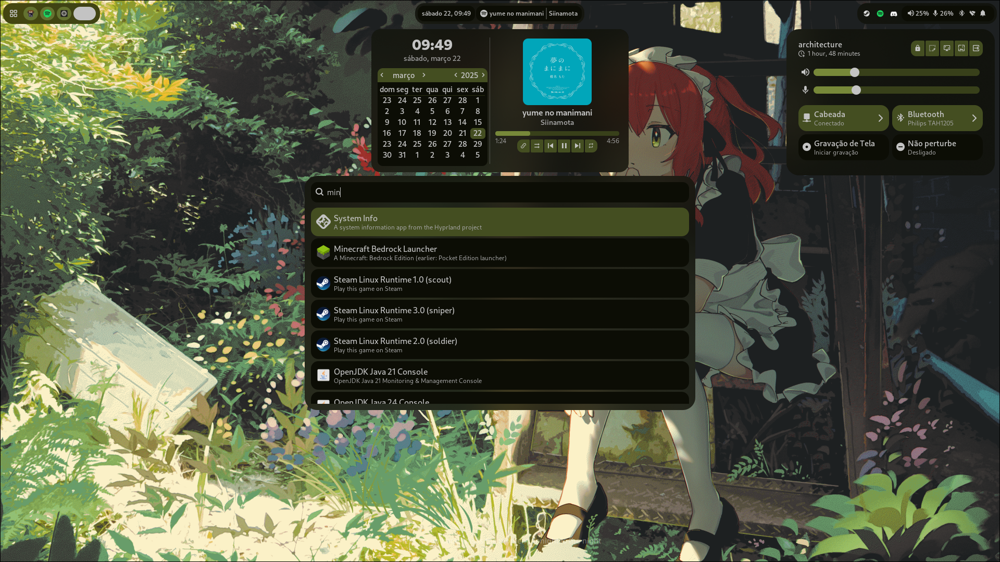
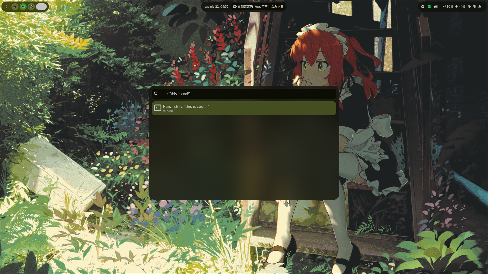
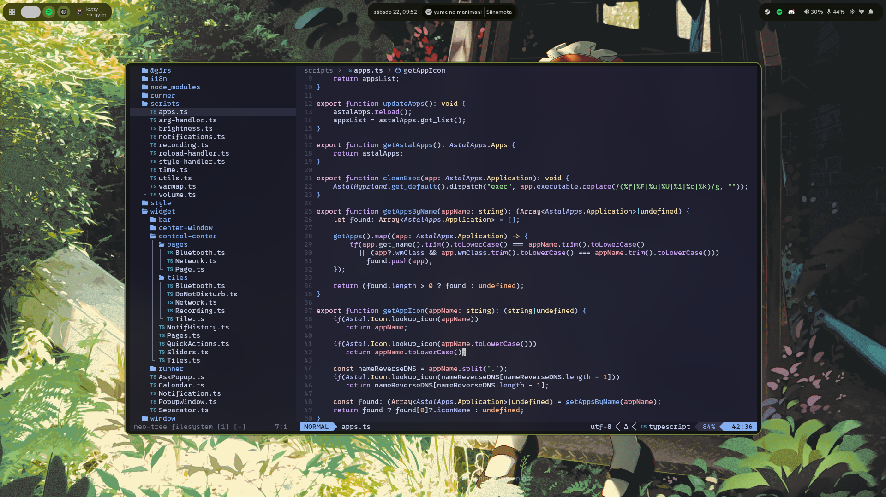

# Retrozinn's Hyprland Dots
My Hyprland dotfiles that I keep improving almost everyday! 🤩 (i love doing this)  

> [!note]
> This is very work in progress, it's an Aylur's GTK Shell version of my dots! I absolutely  
> don't recommend installing this one, since it's WIP.
> If you're searching for the stable dotfiles, go to the [`ryo`](https://github.com/retrozinndev/Hyprland-Dots/tree/ryo) branch!  

## ✔️ What's already done
- Notification Popups(with actions support!)
- Runner for applications and commands, supports making plugins to show custom results by prefix with TypeScript
- Bluetooth and Network Toggles + Manage bluetooth and network devices by the control center itself!
- Beatiful media player
- Apps Window(Gnome-like, full screen)
- Super cool and blurred Bar, Control Center and everything!

## 🔘 TODO List
- Support for multiple monitors
- Notification History list
- Per-app Volume(can be done after release / low priority)
- Maybe a settings app in the future? ✨

## 🌄 Screenshots

## 🎨 Colors
All the colors of the interface are dynamically generated from your wallpaper! This is possible by using [pywal16] (fork of pywal), a cli tool to generate color schemes on the fly.

## 🖼️ Wallpapers
When you're at the [Installation](#Installation) process, you can choose whether to install my wallpapers. If you chose to install, you can select any of them by clicking to change wallpaper in the Control Center. Or if you haven't chose to install, you can create the directory `~/wallpapers` in your home directory `~` and put an image you want to use as wallpaper and choose it using the menu inside control center and also by pressing <kbd>SUPER</kbd> + <kbd>W</kbd>!

See more bindings inside the `~/.config/hypr/bindings.conf` file or check the [Wiki/Usage] page!

### ℹ️ Source
All wallpapers inside this repo are not made by me! You can find all sources inside the [`WALLPAPERS.md`](https://github.com/retrozinndev/Hyprland-Dots/blob/ryo/WALLPAPERS.md) file.

## ⚙️ Installation
See the Installation Guide on [Wiki/Installation].

## 🎉 Tools
- Browser: [Zen Browser]
- Text Editor: [Neovim], my config is [here](https://github.com/retrozinndev/nvim-conf.lua)
- Terminal Emulator: [Kitty]
- Bar and Widgets: [Astal](https://aylur.github.io/astal) and [AGS](https://aylur.github.io/ags)
- Shell: [Nushell]
- See more on the [wiki]!

## ❗ Issues
Having issues? Please create a [new Issue] here, I'll be happy to help you out!

## 📜 License
This repo is licensed under the [MIT License].

## 🌠 Stargazers
Thanks to everyone who starred my dotfiles! 💖

<!-- References of other projects -->
[pywal16]: https://github.com/eylles/pywal16
[zen browser]: https://zen-browser.app
[neovim]: https://neovim.io
[nushell]: https://nushell.sh
[kitty]: https://sw.kovidgoyal.net/kitty

<!--  Web refs -->
[mit license]: https://en.wikipedia.org/wiki/MIT_License

<!-- Tabs -->
[wiki]: https://github.com/retrozinndev/Hyprland-Dots/wiki
[issues]: https://github.com/retrozinndev/Hyprland-Dots/issues

<!-- Wiki Pages -->
[wiki/dependencies]: https://github.com/retrozinndev/Hyprland-Dots/wiki/Dependencies
[wiki/usage]: https://github.com/retrozinndev/Hyprland-Dots/wiki/Usage
[wiki/installation]: https://github.com/retrozinndev/Hyprland-Dots/wiki/Installation

<!-- Action Links -->
[new issue]: https://github.com/retrozinndev/Hyprland-Dots/issues/new
