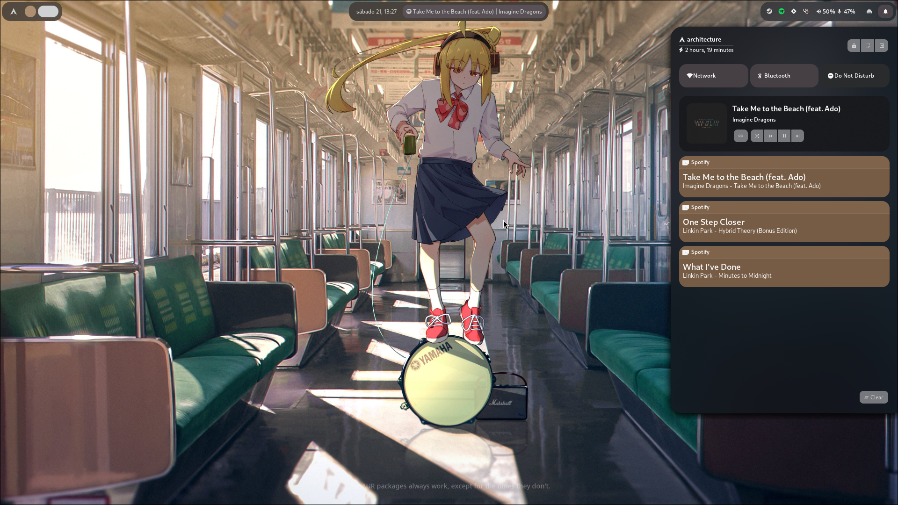
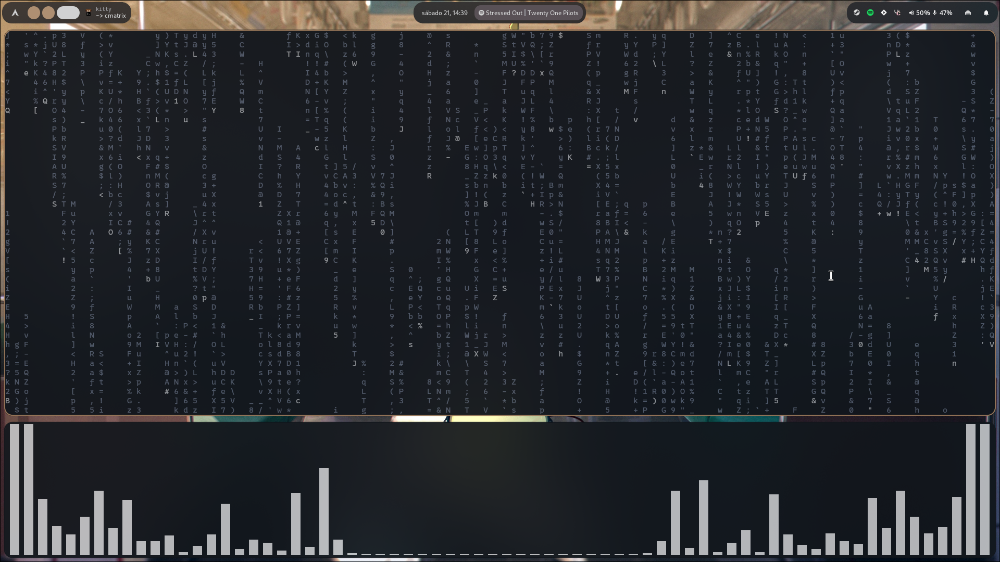
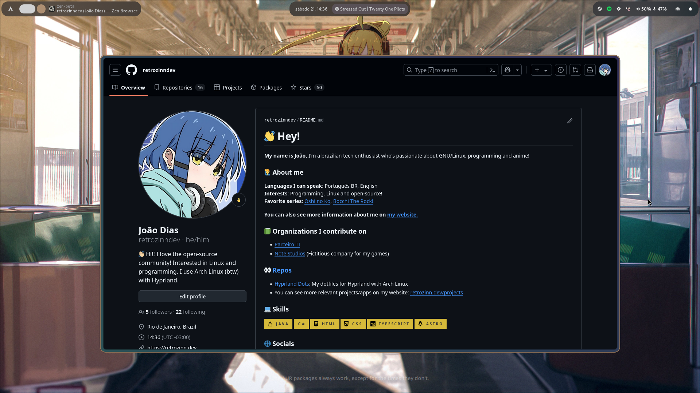
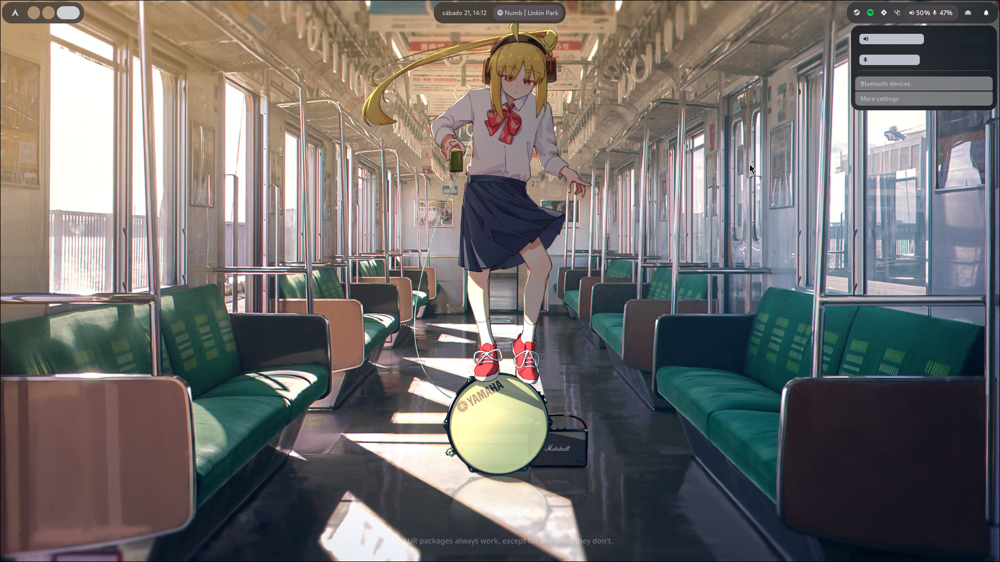
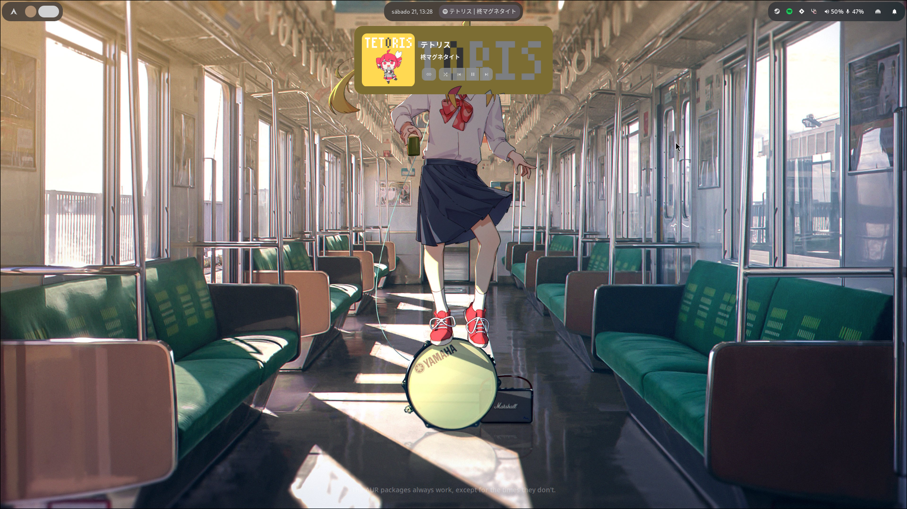
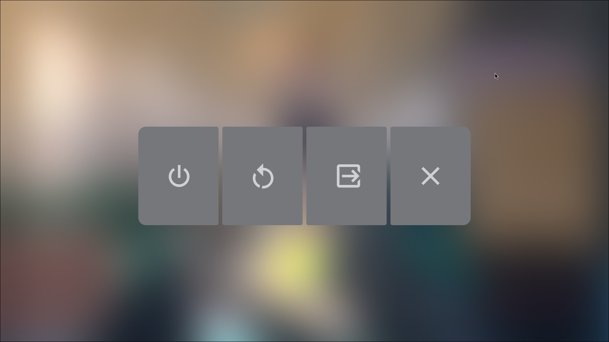

# Retrozinn's Hyprland Dots
My customized Hyprland dotfiles that I keep improving almost everyday 🤩 !

> [!warning]
> This is the branch for the Elkowar's Wacky Widgets(eww) edition! If you're  
> here for the waybar version instead, go to the [`waybar-edition`](https://github.com/retrozinndev/Hyprland-Dots/tree/waybar-edition) branch!

> [!note]
> I'm currently developing an [AGS](https://aylur.github.io/ags)+[Astal](https://aylur.github.io/astal) version of these dots! Peek a little on  
> how developement is going in the [`ryoland`](https://github.com/retrozinndev/Hyprland-Dots/tree/ryoland) branch.  

## 🌄 Screenshots

## 🎨 Colors
All the colors of the interface are dynamically generated from your wallpaper! This is possible by using [pywal16] (fork of pywal), a cli tool to generate color schemes on the fly.

## 🖼️ Wallpapers
When you're at the [Installation](#Installation) process, you can choose whether to install my wallpapers. If you chose to install, you can select any of them by clicking to change wallpaper in the Control Center. Or if you haven't chose to install, you can create the directory `~/wallpapers` in your home directory `~` and put an image you want to use as wallpaper and choose it using the menu inside control center and also by pressing <kbd>SUPER</kbd> + <kbd>W</kbd>!

See more bindings inside the `~/.config/hypr/bindings.conf` file or check the [Wiki/Usage] page!

### ℹ️ Source
All wallpapers inside this repo are not made by me! You can find all sources inside the [`WALLPAPERS.md`](https://github.com/retrozinndev/Hyprland-Dots/blob/ryo/WALLPAPERS.md) file.

## ⚙️ Installation
See the Installation Guide on [Wiki/Installation].

### 🎉 Tools
- Browser: [Zen Browser]
- Text Editor: [Neovim], my config is [here](https://github.com/retrozinndev/nvim-conf.lua)
- Terminal Emulator: [Kitty]
- Shell: [Nushell]
- See more on the [wiki]!

## ❗ Issues
Having issues? Please create a [new Issue] here, I'll be happy to help you out!

## 📜 License
This repo is licensed under the [MIT License].

## 🌠 Stargazers Graph
Thanks to everyone who starred my dotfiles! 💖

<!-- References of other projects -->
[pywal16]: https://github.com/eylles/pywal16
[zen browser]: https://zen-browser.app
[neovim]: https://neovim.io
[nushell]: https://nushell.sh
[kitty]: https://sw.kovidgoyal.net/kitty/

<!--  Web refs -->
[mit license]: https://en.wikipedia.org/wiki/MIT_License

<!-- Tabs -->
[wiki]: https://github.com/retrozinndev/Hyprland-Dots/wiki
[issues]: https://github.com/retrozinndev/Hyprland-Dots/issues

<!-- Wiki Pages -->
[wiki/dependencies]: https://github.com/retrozinndev/Hyprland-Dots/wiki/Dependencies
[wiki/usage]: https://github.com/retrozinndev/Hyprland-Dots/wiki/Usage
[wiki/installation]: https://github.com/retrozinndev/Hyprland-Dots/wiki/Installation

<!-- Action Links -->
[new issue]: https://github.com/retrozinndev/Hyprland-Dots/issues/new
