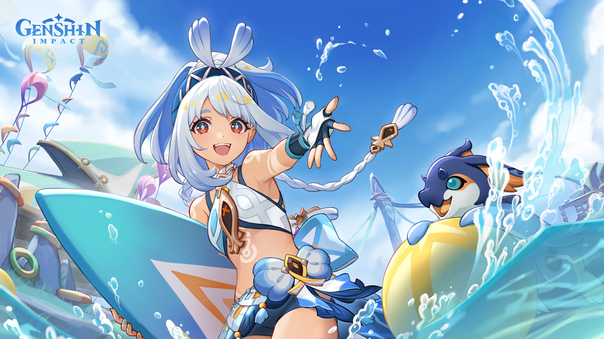

# About Walppapers

None of them are made by me. You can find their artists, and more wallpapers 
in their source link.

## Bocchi The Rock!

  

    <b>Kessoku Band Rooftop (cropped borders)</b>
  

  
</img>

- Source: [Alpha Coders](https://wall.alphacoders.com/big.php?i=1319345)

  

    <b>Bocchi The Rock! (the wallpaper)</b>
  

  
</img>

- Source: [Twitter/X (artist only, post was deleted)](https://x.com/mofujiro_mofum2)

  

    <b>Ryo Yamada Maid Dress</b>
  

  
</img>

- Source: [Alpha Coders](https://wall.alphacoders.com/big.php?i=1363565)

  

    <b>Ryo Yamada</b>
  

  
</img>

- Source: [Alpha Coders](https://wall.alphacoders.com/big.php?i=1323120)

  

    <b>Ryo Vending Machine</b>
  

  
</img>

- Source: [Alpha Coders](https://wall.alphacoders.com/big.php?i=1293921)

  

    <b>Nijika Train</b>
  

  
</img>

- Source: [Alpha Coders](https://wall.alphacoders.com/big.php?i=1304192)

  

    <b>Nijika Ijichi</b>
  

  
</img>

- Source: [Wallpaper Flare](https://www.wallpaperflare.com/blonde-nijika-ijichi-bocchi-the-rock-anime-girls-sunset-glow-wallpaper-yjrwx)

  

    <b>Kita Street</b>
  

  
</img>

- Source: [Alpha Coders](https://wall.alphacoders.com/big.php?i=1304193)

  

    <b>Kita-chan!!</b>
  

  
</img>

- Source: [Alpha Coders](https://wall.alphacoders.com/big.php?i=1296783)

  

    <b>Kikuri Hiroi</b>
  

  
</img>

- Source: [Alpha Coders](https://wall.alphacoders.com/big.php?i=1295717)

  

    <b>Kessoku Band Reunited</b>
  

  
</img>

- Source: [Wallpaper Cave](https://wallpapercave.com/w/wp11695992)

  

    <b>Kessoku Albums</b>
  

  
</img>

- Source: [Alpha Coders](https://wall.alphacoders.com/big.php?i=1316133)

  

    <b>Hitori Gotoh College Corridor</b>
  

  
</img>

- Source: [Alpha Coders](https://wall.alphacoders.com/big.php?i=1302067)

  

    <b>Garden Kita</b>
  

  
</img>

- Source: [Gruvbox Wallpapers](https://gruvbox-wallpapers.pages.dev)

<!----------------- -->
## Vocaloid Wallpapers

  

    <b>Arch Linux Miku</b>
  

  
</img>

- Source: [DeviantArt](https://www.deviantart.com/nesyah/art/Arch-linux-feat-Hatsune-Miku-858316759)

  

    <b>Gumi Bridge</b>
  

  
</img>

- Source: [Alpha Coders](https://wall.alphacoders.com/big.php?i=593482)

  

    <b>Gumi Forest Sunlight</b>
  

  
</img>

- Source: [Alpha Coders](https://wall.alphacoders.com/big.php?i=930443)

  

    <b>Miku Balloons</b>
  

  
</img>

- Source: [Alpha Coders](https://wall.alphacoders.com/big.php?i=768576)

  

    <b>Miku Green Hair Glasses</b>
  

  
</img>

- Source: [Alpha Coders](https://wall.alphacoders.com/big.php?i=858278)

  

    <b>Kagamine Rin Yellow Tapes</b>
  

  
</img>

- Source: [Alpha Coders](https://wall.alphacoders.com/big.php?i=1292852)

  

    <b>Gumi VOCALOID</b>
  

  
</img>

- Source: [Alpha Coders](https://wall.alphacoders.com/big.php?i=768096)

  

    <b>Miku Stylish with Glasses</b>
  

  
</img>

- Source: [Alpha Coders](https://wall.alphacoders.com/big.php?i=1305668)

  

    <b>Miku Winter</b>
  

  
</img>

- Source: [Alpha Coders](https://wall.alphacoders.com/big.php?i=1305841)

  

    <b>Vocaloid Karaoke</b>
  

  
</img>

- Source: [Alpha Coders](https://wall.alphacoders.com/big.php?i=770194)

  

    <b>Miku, Rin and Luka Chibi</b>
  

  
</img>

- Source: [Alpha Coders](https://wall.alphacoders.com/big.php?i=770164)

  

    <b>Miku Guitar</b>
  

  
</img>

- Source: [Alpha Coders](https://wall.alphacoders.com/big.php?i=867976)

  

    <b>Miku Garden</b>
  

  
</img>

- Source: [Alpha Coders](https://wall.alphacoders.com/big.php?i=1315430)

  

    <b>Miku Setup</b>
  

  
</img>

- Source: [Alpha Coders](https://wall.alphacoders.com/big.php?i=672757)

  

    <b>Miku Flower Field</b>
  

  
</img>

- Source: [Alpha Coders](https://wall.alphacoders.com/big.php?i=688123)

  

    <b>Miku Door</b>
  

  
</img>

- Source: [Alpha Coders](https://wall.alphacoders.com/big.php?i=845583)

  

    <b>Miku Crying with Mask</b>
  

  
</img>

- Source: [Alpha Coders](https://wall.alphacoders.com/big.php?i=524092)

  

    <b>Miku City Sky</b>
  

  
</img>

- Source: [Alpha Coders](https://wall.alphacoders.com/big.php?i=698444)

  

    <b>Miku Bush</b>
  

  
</img>

- Source: [Alpha Coders](https://wall.alphacoders.com/big.php?i=631739)

  

    <b>Hatsune Miku Birthday!</b>
  

  
</img>

- Source: [Alpha Coders](https://wall.alphacoders.com/big.php?i=731810)

  

    <b>Hatsune Miku and Megurine Luka</b>
  

  
</img>

- Source: [Alpha Coders](https://wall.alphacoders.com/big.php?i=1313438)

  

    <b>Gumi Ocean Sunset</b>
  

  
</img>

- Source: [WallHaven](https://wallhaven.cc/w/we8pgx)

  

    <b>Gumi Street Bike</b>
  

  
</img>

- Source: [WallHaven](https://wallhaven.cc/w/4x7e7o)

  

    <b>Inabakumori Kaai Yuki</b>
  

  
</img>

- Source: [WallHaven](https://wallhaven.cc/w/wed3m7)

  

    <b>Inabakumori Osage</b>
  

  
</img>

- Source: [WallHaven](https://wallhaven.cc/w/o3r8z9)

<!----------------- -->
## Frieren: Beyond Journey's End

  

    <b>Frieren Underwater</b>
  

  
</img>

- Source: [Pixiv](https://www.pixiv.net/en/artworks/114234634)

  

    <b>Frieren Rain</b>
  

  
</img>

- Source: [Pixiv](https://www.pixiv.net/en/artworks/114234634)

  

    <b>Frieren At The Funeral</b>
  

  
</img>

- Source: [Pixiv](https://www.pixiv.net/en/artworks/114234634)

  

    <b>Frieren Sunset</b>
  

  
</img>

- Source: [Alpha Coders](https://wall.alphacoders.com/big.php?i=1354394)

  

    <b>Frieren Sending Kiss</b>
  

  
</img>

- Source: [Alpha Coders](https://wall.alphacoders.com/big.php?i=1344010)

  

    <b>Frieren Ring</b>
  

  
</img>

- Source: [Alpha Coders](https://wall.alphacoders.com/big.php?i=1351964)

  

    <b>Frieren Night Film</b>
  

  
</img>

- Source: [Wallpaper Flare](https://www.wallpaperflare.com/anime-anime-girls-sousou-no-frieren-wallpaper-yvcxe)

  

    <b>Frieren Blue</b>
  

  
</img>

- Source: [Alpha Coders](https://wall.alphacoders.com/big.php?i=1357998)

<!----------------- -->
## Oshi no Ko

  

    <b>Oshi no Ko Kana Arima</b>
  

  
</img>

- Source: [WallHaven](https://wallhaven.cc/w/x6pp5z)

<!---------------- -->
## Gruvbox-styled

  

    <b>Balcony Girl</b>
  

  
</img>

- Source: [Gruvbox Wallpapers](https://gruvbox-wallpapers.pages.dev)

  

    <b>Gruvbox Girl</b>
  

  
</img>

- Source: [Gruvbox Wallpapers](https://gruvbox-wallpapers.pages.dev)

- [Gruvbox Wallpapers](https://gruvbox-wallpapers.pages.dev)

<!---------------- -->
## Gruvbox-styled Wallpapers

- [Gruvbox Wallpapers](https://gruvbox-wallpapers.pages.dev)

## Genshin Impact Wallpaper(s)
Those can be get on web events in Genshin Impact, and also on [HoYoLAB](https://hoyolab.com).

  

    <b>Mualani!!</b>
  

  
</img>

- Source: Genshin Impact Web Event (not available anymore)

## Others

  

    <b>Hypr-chan</b>
  

  
</img>

- Source: [GitHub (hyprwm/Hyprland)](https://github.com/hyprwm/Hyprland)

  

    <b>Linux Anime Girl</b>
  

  
</img>

- Source: [WallHere](https://wallhere.com/en/wallpaper/2284648)

### More sources
- [Pinterest](https://pinterest.com)
- [AlphaCoders](https://alphacoders.com/bocchi-the-rock!-wallpapers)
- [WallpaperCave](https://wallpapercave.com/bocchi-the-rock-wallpapers)
- [WallpaperFlare](https://www.wallpaperflare.com/search?wallpaper=BOCCHI+THE+ROCK%21)
